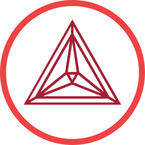

# Agentic-Additive-Manufacturing-Alloy-Discovery
Multi-agent workflow configuration for additive manufacturing alloy discovery via Model Context Protocol (MCP)

<p align="center">
  
</p>

## Getting Started
1. Clone Repository
2. Install LLM client such as [Claude Code](https://docs.anthropic.com/en/docs/claude-code/setup), [Codex](https://developers.openai.com/codex/cli/) or, [Gemini CLI](https://github.com/google-gemini/gemini-cli)
3. Install MCP tools and Agents to Client
    ```
    uv run main.py claude-code
    ```

## MCP Servers
<div style="display: grid; gap: 1em;">
  <div style="display: flex; flex: col; gap: 1em; justify-items: center;">
    
    <div>
      <div>
        <a href="https://github.com/ppak10/additive-manufacturing">
          <h3 style="margin: 0px">
            Additive Manufacturing
          </h3>
        </a>
      </div>
      <div>
        <code>uv add additive-manufacturing</code>
      </div>
      <div>
        <code>pip install additive-manufacturing</code>
      </div>
    </div>
  </div>

  <div style="display: flex; flex: col; gap: 1em; justify-items: center">
    
    <div>
      <div>
        <a href="https://github.com/ppak10/thermo-calc">
          <h3 style="margin: 0px">
            Thermo-Calc 
          </h3>
        </a>
      </div>
      <div>
        <code>uv add thermo-calc</code>
      </div>
      <div>
        <code>pip install thermo-calc</code>
      </div>
    </div>
  </div>

  <div style="display: flex; flex: col; gap: 1em; justify-items: center">
    
    <div>
      <div>
        <a href="https://github.com/ppak10/workspace-agent">
          <h3 style="margin: 0px">
            Workspace Agent
          </h3>
        </a>
      </div>
      <div>
        <code>uv add workspace-agent</code>
      </div>
      <div>
        <code>pip install workspace-agent</code>
      </div>
    </div>
  </div>
</div>
