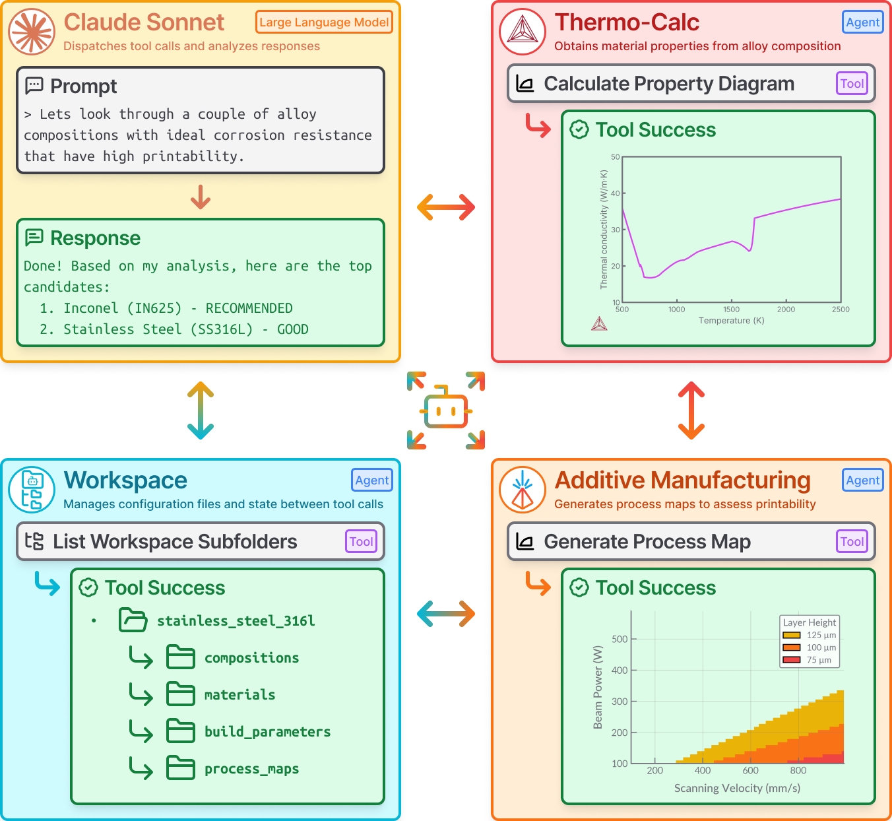
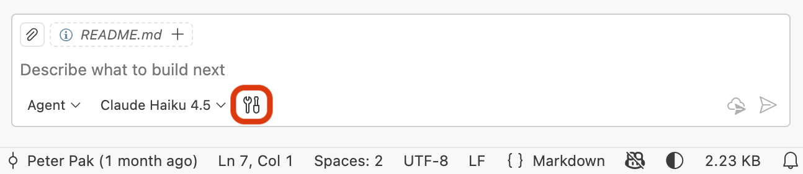
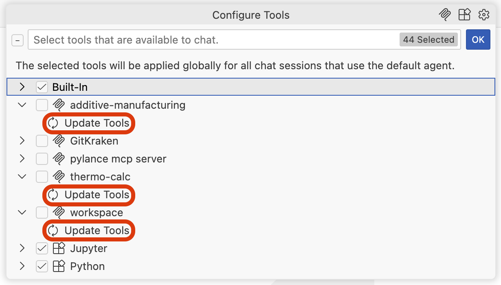

# Agentic-Additive-Manufacturing-Alloy-Evaluation
Multi-agent workflow configuration for additive manufacturing alloy evaluation via Model Context Protocol (MCP)

<p align="center">
  
</p>

## Getting Started
1. Clone Repository
2. Install Thermo-Calc 2025B with TC-Python
    - Make sure environment variables `TC25B_HOME`, `LSHOST`, and `JAVA_HOME` are set.
3. Install [`uv`](https://docs.astral.sh/uv/)
4. Sync `additive-manufacturing`, `thermo-calc`, and `workspace-agent` packages.
    ```bash
    uv sync
    ```
1. Install LLM client such as [Claude Code](https://docs.anthropic.com/en/docs/claude-code/setup), [Codex](https://developers.openai.com/codex/cli/) or, [Gemini CLI](https://github.com/google-gemini/gemini-cli)
5. Install MCP tools and Agents to Client (i.e. [`vscode`](), [`claude-code`](https://docs.anthropic.com/en/docs/claude-code/setup), [`codex`](https://developers.openai.com/codex/cli/), or[`gemini-cli`](https://github.com/google-gemini/gemini-cli))
    ```
    uv run main.py <client>
    ```

### VSCode
1. Open Copilot and click on the tools icon
<p align="center">
  
</p>

2. Update the tools for `additive-manufacturing`, `thermo-calc`, and `workspace`
<p align="center">
  
</p>

3. (Optional) Toggle off all other tools for better performance (i.e. "Built-In", "Python", "Jupyter", etc.)

## MCP Servers
<div style="display: grid; gap: 1em;">
  <div style="display: flex; flex: col; gap: 1em; justify-items: center;">
    
    <div>
      <div>
        <a href="https://github.com/ppak10/additive-manufacturing">
          <h3 style="margin: 0px">
            Additive Manufacturing
          </h3>
        </a>
      </div>
      <div>
        <code>uv add additive-manufacturing</code>
      </div>
      <div>
        <code>pip install additive-manufacturing</code>
      </div>
    </div>
  </div>

  <div style="display: flex; flex: col; gap: 1em; justify-items: center">
    
    <div>
      <div>
        <a href="https://github.com/ppak10/thermo-calc">
          <h3 style="margin: 0px">
            Thermo-Calc 
          </h3>
        </a>
      </div>
      <div>
        <code>uv add thermo-calc</code>
      </div>
      <div>
        <code>pip install thermo-calc</code>
      </div>
    </div>
  </div>

  <div style="display: flex; flex: col; gap: 1em; justify-items: center">
    
    <div>
      <div>
        <a href="https://github.com/ppak10/workspace-agent">
          <h3 style="margin: 0px">
            Workspace Agent
          </h3>
        </a>
      </div>
      <div>
        <code>uv add workspace-agent</code>
      </div>
      <div>
        <code>pip install workspace-agent</code>
      </div>
    </div>
  </div>
</div>
